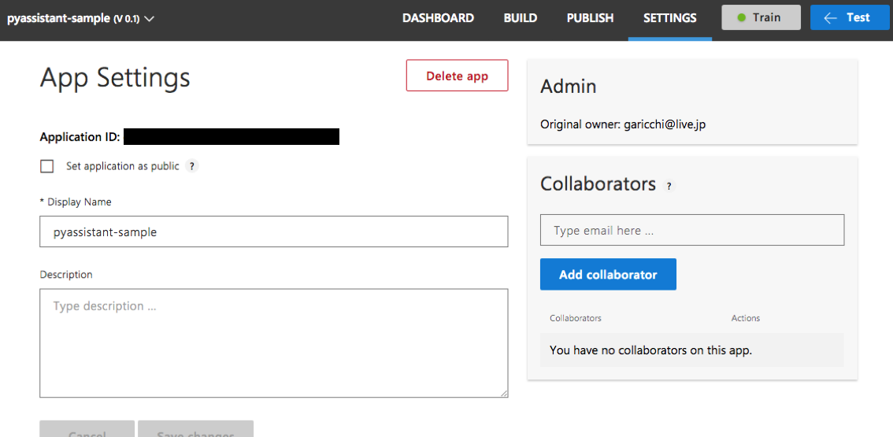
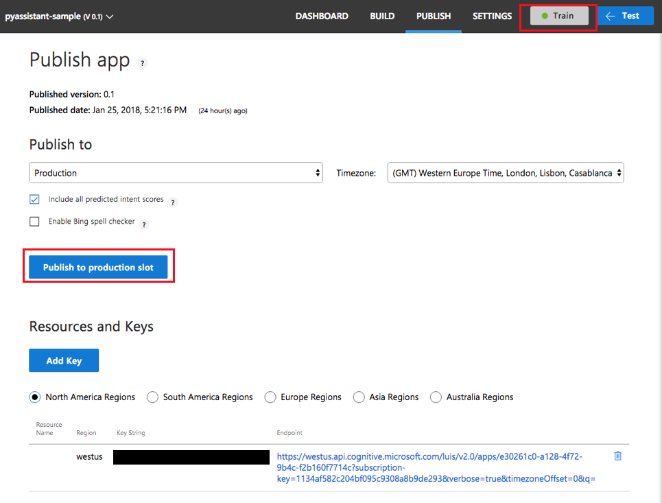

# PyAssistant
Make your raspberry pi a smart speaker :speaker:

## ABILLITIES

- Acoustic Speech Recognition
    - Cognitive Service Speech Api with sox
- Hotword Detection
    - Snowboy
    - button trigger
- Speech Language Understanding
    - Cognitive Service LUIS Api
- Text To Speech
    - Open Jtalk
- IR Control

## INSTALL

### clone and install package
```sh
git clone https://github.com/garicchi/pyassistant.git
cd pyassistant
./setup.sh
```

### copy sample python script
```sh
cp samples/app.py .
```


### get cognitive service keys

access and register here (https://azure.microsoft.com/ja-jp/try/cognitive-services/)[https://azure.microsoft.com/ja-jp/try/cognitive-services/]

get following apis

- Bing Speech API Key
- Bing Video Search API Key

### setup luis

download sample

```sh
wget https://raw.githubusercontent.com/garicchi/pyassistant/master/sample/luis-pyassistant-sample.json
```

access and register here (https://www.luis.ai/)[https://www.luis.ai/]

click ```import new app``` and upload above json file

move ```setting``` and get ```app id```



press ```train``` and press ```Publish to Production slot```

get ```app key```




### paste api keys

edit and paste above api keys
```sh
nano ~/.pyassistant/setting.json
```

## RUN ASSISTANT IN CONSOLE

```sh
python app.py assistant run
```
