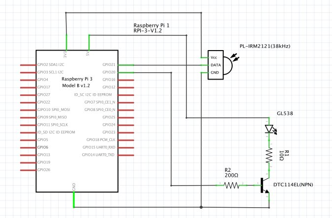

# PyAssistant
Make your raspberry pi a smart speaker :speaker:

## ABILLITIES

- Acoustic Speech Recognition
    - Cognitive Service Speech Api with sox
- Hotword Detection
    - Snowboy
    - button trigger
- Speech Language Understanding
    - Cognitive Service LUIS Api
- Text To Speech
    - Open Jtalk
- IR Control

## INSTALL

### clone and install package
```sh
git clone https://github.com/garicchi/pyassistant.git
cd pyassistant
./setup.sh
```

### copy sample python script
```sh
cp samples/app.py .
```


### get cognitive service keys

access and register here [https://azure.microsoft.com/ja-jp/try/cognitive-services/](https://azure.microsoft.com/ja-jp/try/cognitive-services/)

get following apis

- Bing Speech API Key
- Bing Video Search API Key

### setup luis

download sample

```sh
wget https://raw.githubusercontent.com/garicchi/pyassistant/master/sample/luis-pyassistant-sample.json
```

access and register here [https://www.luis.ai/](https://www.luis.ai/)

click ```import new app``` and upload above json file

move ```setting``` and get ```app id```


press ```train``` and press ```Publish to Production slot```

get ```app key```


### paste api keys

edit and paste above api keys
```sh
nano ~/.pyassistant/setting.json
```

## RUN ASSISTANT IN CONSOLE

```sh
python3 app.py assistant run
```

you can say "ハローラズパイ" and can say "今日の天気は？"

## IR contorol

buy some circuit elements

- [赤外線LED GL538](http://akizukidenshi.com/catalog/g/gI-11894/)
- [赤外線受光モジュール PL-IRM2121(28khz)](http://akizukidenshi.com/catalog/g/gI-01570/)
- [10Ω抵抗](http://akizukidenshi.com/catalog/g/gR-25100/)
- [200Ω抵抗](http://akizukidenshi.com/catalog/g/gR-25201/)
- [LED拡散キャップ](http://akizukidenshi.com/catalog/g/gI-00641/)
- [ブレッドボード](http://akizukidenshi.com/catalog/e/ebread1/)
- [ジャンパーワイヤー](http://akizukidenshi.com/catalog/g/gC-05159/)

### create following circuit



### register ir

```sh
python3 app.py ir register --name 'tv_on' --pin 20
```

### test send

```sh
python3 app.py ir send --name 'tv_on'
```

### send from code
```sh
agent.ir.send_channel('tv_on')
```

### show help for ir

```sh
python3 app.py ir --help
```